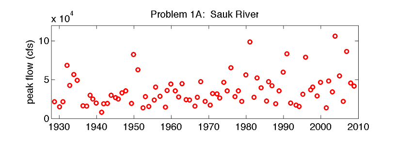

# Homework 7

 
## Problem 1: ENSO Phases
Following Lab 7-1 and Lab 7-2,

**A.** *(1)* Use the time series of the phase of the El Niño Southern Oscillation (ENSO) from 1900-2022 to create a lag-1 Markov model of the ENSO phase, where the observed Phases of ENSO are as follows:

1. warm (El Niño)
2. neutral (ENSO neutral)
3. cool (La Niña)

**B.** *(2)* Using this Markov model and a random number generator, simulate 5,000 years of ENSO data. Then answer the following questions.

  - According to the model, what is the probability that three warm ENSO years would occur in a row?
  - What is the large-sample probability that three cool ENSO years would happen in a row?  (Try refreshing the numbers several times to increase the sample size if the condition never happens.)

Check out this [blog](https://www.climate.gov/news-features/blogs/september-2022-la-ni%C3%B1a-update-it%E2%80%99s-q-time) about why we care about ENSO and the exciting current probability of getting a cool ENSO (La Nina) again in 2023, making it three in a row.

## Probelm 2: Rating Curves and Application of Bayes Theorem with MCMC
 
Following the class discussion and Lab 7-3, explore how the rating curve and the 95% confidence intervals for the Lyell Fork streamflow site change depending on the method you use to determine the rating curve:

**A.** *(2)* Least squares linear regression fitting (with transformed variables) using b = 0.28 m
  - Make 95% confidence intervals around this regression fit
  - Then, assume that we don't know exactly what b is. Try additional linear regressions using different values of b = 0.10, 0.20, 0.30, 0.40, and 0.50 m (you do not need to calculate 95% confidence intervals for these additional fits)
  - Qualitatively, is the range between these 5 additional lines with different b values larger or smaller than the range between the 95% confidence lines from the original fitted line (the one with b = 0.28 cm)?
  
**B.** *(1.5)* Direct monte carlo parameter estimation

**C.** *(1.5)* Bayesian MCMC fitting

Using the code in Lab 7-3, create plots and discuss the differences in the results from these three methods. *(2)*

## Problem 3: 

### For CEE 465: Statistics Synthesis *(2)*

(Your CEE 465 final exam questions will look similar to this.)

You are given the below dataset of annual peak flows on the Sauk River: 

(Note, you do not need to do any actual analysis here)

For each of the following questions about this dataset, I want you to answer:
 - How do you ask this question statistically? 
 - What tools should you use to answer this question? (think of techniques we’ve learned in class)
 - What should you be careful about? (think of caveats and requirements of the tools you’re recommending).

 **A.** Presume some logging occurred in the watershed in 1970. Are peak flows higher after 1970 than before 1970?
 
 **B.** Presume some logging occurred in the watershed in 1970. Have peak flows become more variable after 1970 than before 1970?
 
 **C.** If the mean annual peak flow has increased to above 50,000 cfs, the town will rebuild the levees. What are the chances that our statistical test would fail to identify this change?
 
 **D.** Has there been a trend in peak flows between 1930 and 2010? How fast are peak flows changing, and is this trend significant?
 
 ### For CEWA 565: Peer Reviews

Complete the peer review(s) that you were assigned on Canvas. Your review should be thoughtful, but it does not need to be long, nor does it need to focus on minor spelling or grammar mistakes. Write a few sentences describing the most important change that can be made to improve the draft (e.g. "reorganize the paragraphs to better explain X", "add more supporting evidence for the topic statement"). Refer to the prior homework assignment to see guidelines for the draft project reports. (the rubric for the final report is available for your reference [here](/overview/b-project.md))