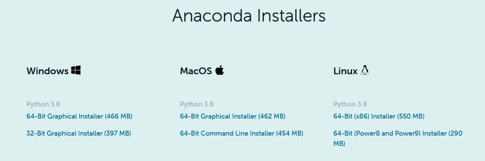
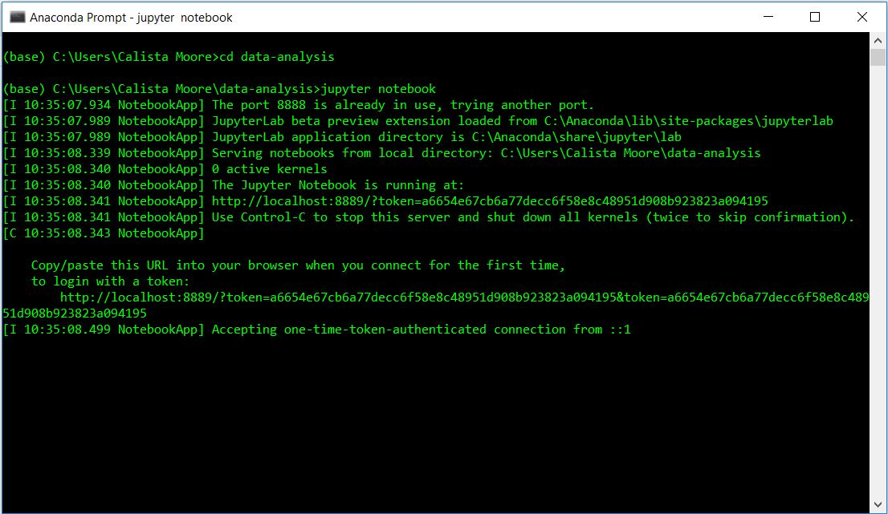
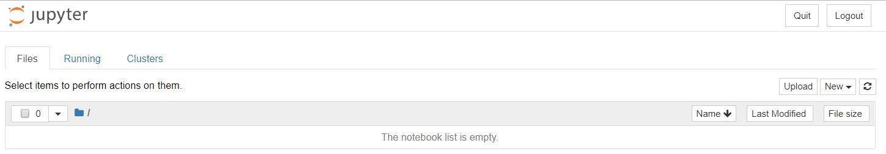
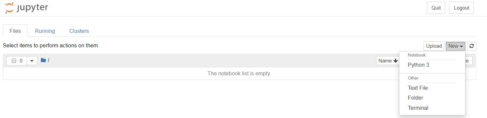
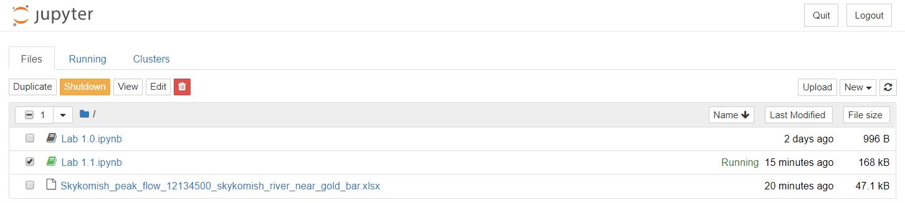
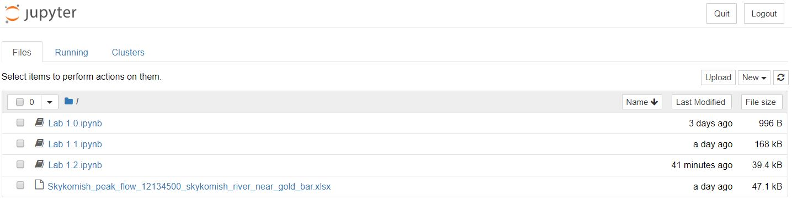

# Python

 * [Python Glossary](https://www.codecademy.com/articles/glossary-python): See the glossary for information about the basic structure and objects of Python coding. 
 * [Python Documentation](https://docs.python.org/3/) This is the official Python documentation which has information about Python's libraries, functions, classes,  and terminology. This documentation is very helpful with troubleshooting your code and understanding how your code works. Be sure to select your version of Python in the upper left hand corner of the documentation. 

## Getting started with python

These tutorials can help you get started using python, or use them as reference material for more advanced tasks as you learn throughout the quarter.

 * [Intro to Programming and Plotting with Python](http://swcarpentry.github.io/python-novice-gapminder/) (This is a good place to start!)
 * [Whirlwind Tour of Python, free PDF book](https://www.oreilly.com/programming/free/files/a-whirlwind-tour-of-python.pdf), and [jupyter notebooks](https://github.com/jakevdp/WhirlwindTourOfPython) (This is more extensive and includes more advanced details.)
 * [Python Data Science Handbook](https://jakevdp.github.io/PythonDataScienceHandbook/) (Even more advanced details by the same author.)

If you're a MATLAB user, [NumPy for Matlab users](https://docs.scipy.org/doc/numpy-1.14.0/user/numpy-for-matlab-users.html) is another great resource.


## Data visualization libraries

These are some popular python libraries for visualization and ploting.

 * [Matplotlib](https://matplotlib.org/) (we'll use this most often)
 * [Plotting with pandas](https://pandas.pydata.org/pandas-docs/stable/user_guide/visualization.html) (pandas uses matplotlib)
 * [Seaborn](https://seaborn.pydata.org/)
 * [Bokeh](https://bokeh.pydata.org/en/latest/index.html) for making interactive plots in jupyter notebooks
   *  This jupyter notebook provides a demo of the bokeh library and links to other data visualization resources: interactive-plotting-demo.ipynb [preview]
   
   
## Setting up Python, Jupyter Notebook on your own computer

This guide walks through the process of setting up Python and Jupyter Notebook on your own computer. 

```note
While it is possible to run Jupyter Notebooks locally on your own computer, we suggest that you use the [JupyterHub](https://spestana.github.io/data-analysis-rtd/resources/b-learning-jupyter.html#jupyterhub) for labs, homeworks, and projects in this class.
```

### Setting up Anaconda

Anaconda is a Python distribution. It provides the Python language, packages, and package management. Overall, Anaconda makes Python easier to use. When you install Anaconda, you will also install Python.

* Downloading Anaconda
  * Go to [https://www.anaconda.com/products/individual](https://www.anaconda.com/products/individual) and click "Download"
  * Click the download link for your operating system (Windows, Mac, Linux). 
  


### Getting Started with Jupyter Notebooks

Jupyter Notebooks are a way to write and run Python code. By installing Anaconda, you have access to Jupyter Notebooks. They allow you to break up code into "cells" and run these cells individually.

This section will help you get started with accessing, creating, and running Jupyter Notebooks.

1. Navigation and package management
  * **Unix Shell**: We can use basic Unix Shell commands to open Jupyter Notebooks. If you are new to the Unix Shell, see this tutorial for learning about the Unix Shell (focus on the introduction and "Navigating Files and Directories" sections): (http://swcarpentry.github.io/shell-novice/)[http://swcarpentry.github.io/shell-novice/]
    * For a summary of the key points of the Unix Shell, see (https://swcarpentry.github.io/shell-novice/reference/)[https://swcarpentry.github.io/shell-novice/reference/].
    * To navigate around the Unix Shell, these are some basic commands that you will need:
      * `cd` changes your directory
      * `cd ..` moves up one level in a directory tree
      * `ls` lists your directory
  * **Environment and package management**: 
    * `conda install` to install a package
    * `conda list` to list all installed packages
    * See the [Managing Envrionments](https://docs.conda.io/projects/conda/en/latest/user-guide/tasks/manage-environments.html) documentation for details

2. Creating Jupyter Notebooks
  * Create a folder to store all files for this class. For example, on Windows computers, I recommend creating the folder under "Windows (C:)" then "Users" then "Your Username". Do not include spaces in the name of your folder.
  * Search "terminal" or "anaconda prompt" in your computer's searchbar to find the Command Prompt or Anaconda Prompt. Open one of these programs.
  * Navigate to the folder that you created in step one using the commands provided above in the "Unix Shell" section.
  * Open the Jupyter Notebook Interface by typing `jupyter notebook`.
  * Your command prompt should look similar to this: 

  * A tab with the Jupyter Notebook interface will open in your browser.

  * Create a new Jupyter Notebook by selecting "New" in the upper right hand corner and then "Python 3".

  * You have now created a Jupyter Notebook to run Python code in. The next labs will provide you with some basics of Python coding. See the "Resources to Learn Python Programming" for more, including tutorials, glossaries, and documentation.
  * To close the Jupyter Notebook and the interface, save your notebook and return to the interface. Select your notebook and click "Shutdown". Then, click "Quit" in the upper right hand corner of the interface page. You can now also close the Anaconda Prompt or terminal.

  * Opening Existing Jupyter Notebooks
    * Follow the steps from the section above to reach the Jupyter Notebook interface.
    * You will see all existing Jupyter Notebooks saved to your folder. Click on the notebook that you want to open.


```note
When downloading Jupyter Notebooks, be sure to either save them or move them to your folder for this class.
```
