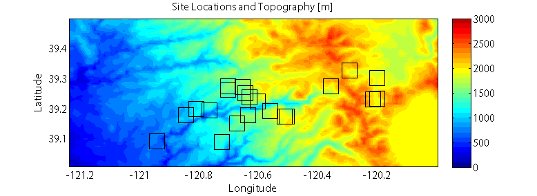

# 8) SVD, Timeseries Analysis


```note
## Lab 8:

Download the lab and data files to your computer. Then, upload them to your JupyterHub [following the instructions here](/resources/b-learning-jupyter.html#working-with-files-on-our-jupyterhub).

* [Lab 8-1: SVD with Monthly Precip.](lab8/lab8-1.ipynb)
  * data: [PRISM_4km_1982-2012.mat](https://canvas.uw.edu/courses/1396225/files/folder/Week%2008%20SVD%20EOF%20PCA)
* [Lab 8-2: Timeseries Lab](lab8/lab8-2.ipynb)
  * data: [waterlevel.mat](data/waterlevel.mat)

```

### Homework 7, Problem 2: Air Temperature Observations in Complex Terrain

Download the file [iButtons_2008-2010.mat](data/iButtons_2008-2010.mat), and the [air-temperature-svd.ipynb](lab8/air-temperature-svd.ipynb) jupyter notebook. The data file contains hourly air temperature (°C) observations from 21 distributed sensors (called iButtons) located around the watershed of the North Fork of the American River in the Sierra Nevada of California, recorded over a period from September 2007 to July 2010. It also contains information about the sites’ names, numbers, latitude and longitude coordinates, and elevations. See the figure below for a map of the sites. 
 


Map figure: iButton locations and topographic shading. The sites are located around the American River canyon on the west slope of the Sierra Nevada Mountains in California. Lake Tahoe is the large flat area in the southeast portion of the map.

Optional: Download [North_Fork_American_River_CA_18020128.json](data/North_Fork_American_River_CA_18020128.json) to add the American River watershed outline to your plots.


 **A.** Plot the temperature observations (AIR_TEMPERATURE) at all sites on one plot over time; use the title, xlabel, and ylabel commands to label your plot and its axes. Use xlim to zoom in and examine the data at finer scales. *Qualitatively* describe the dataset, including its minimum and maximum values, its major variability in time, and how correlated the stations appear to be with one another. (you do *not* need to actually compute correlation coefficents here, just describe it qualitatively)
 
 **B.** Use the command: `[U,S,V] = scipy.linalg.svd(AIR_TEMPERATURE_ZEROMEAN, full_matrices=False)` ([read the documentation for this function here](https://docs.scipy.org/doc/scipy/reference/generated/scipy.linalg.svd.html)) to calculate the PCs, variances, and EOFs, respectively, of `AIR_TEMPERATURE_ZEROMEAN` (this is a version of the dataset where the mean temperature at each station has been subtracted out). Describe, *qualitatively*, how the variance is distributed among the patterns; how much is described by the leading pattern? By the second pattern?
 
 **C.** Plot the leading pattern’s spatial weights (EOF) against latitude and longitude. Describe the first pattern’s spatial weights’ sign and variability.
 
 **D.** Plot the leading pattern’s temporal weights (PCs) over time. When are they positive and when are they negative? Consider the PCs’ sign and magnitude, and consider the sign of the EOF in Part C. When does this pattern generate warmer-than-normal temperatures? Colder-thannormal temperatures? Are the anomalies associated with this pattern of the same sign at all sites?
 
 **E.** Repeat C) and D) for the 2nd-leading pattern. Interpret physically what the first two patterns may represent. How much of the dataset is described by the first two modes of variability?
